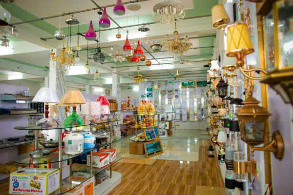
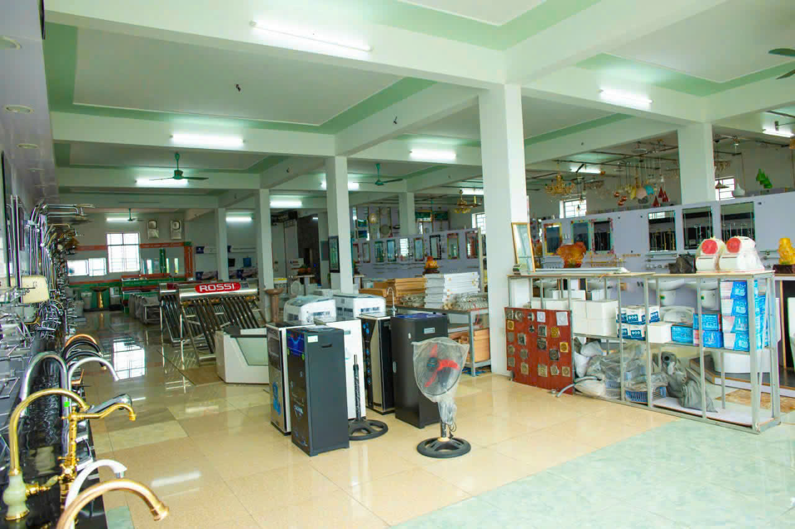

[mau7.txt](https://github.com/user-attachments/files/23147688/mau7.txt)
<section id="san-pham" class="section" aria-labelledby="sanpham-title">
  <h2 id="sanpham-title">Sản phẩm tiêu biểu</h2>
  

    <article class="card">
      
      <h4>Sản phẩm 1</h4>
      
Mô tả sản phẩm 1...

      

        <button class="btn" data-idx="0">Xem ảnh</button>
        <a class="btn" href="#lien-he">Mua hàng</a>
      

    </article>
    <article class="card">
      
      <h4>Sản phẩm 2</h4>
      
Mô tả sản phẩm 2...

      

        <button class="btn" data-idx="1">Xem ảnh</button>
        <a class="btn" href="#lien-he">Mua hàng</a>
      

    </article>
    <article class="card">
      
      <h4>Sản phẩm 3</h4>
      
Mô tả sản phẩm 3...

      

        <button class="btn" data-idx="2">Xem ảnh</button>
        <a class="btn" href="#lien-he">Mua hàng</a>
      

    </article>
    <article class="card">
      
      <h4>Sản phẩm 4</h4>
      
Mô tả sản phẩm 4...

      

        <button class="btn" data-idx="3">Xem ảnh</button>
        <a class="btn" href="#lien-he">Mua hàng</a>
      

    </article>
  

</section>
