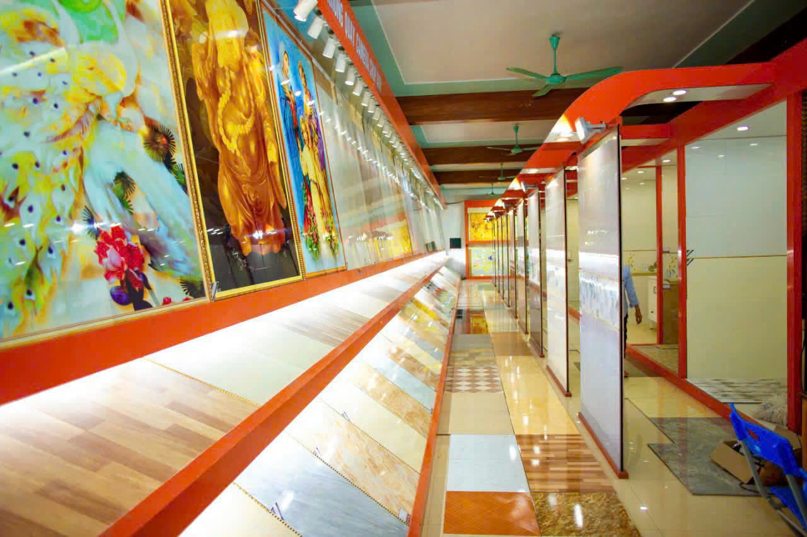
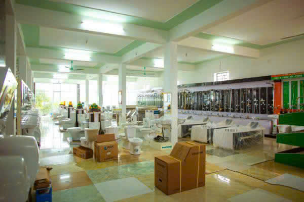

[mau8_Version2.txt](https://github.com/user-attachments/files/23147612/mau8_Version2.txt)
<!-- ... (phần đầu giữ nguyên như bạn đã gửi) ... -->
    <!-- SẢN PHẨM -->
    <section id="san-pham" class="section" aria-labelledby="sanpham-title">
      <h2 id="sanpham-title">Sản phẩm tiêu biểu</h2>

      <!-- Products grid -->
      

        <article class="card">
          
          <h4>Tranh kính nghệ thuật & Gạch lát sàn</h4>
          
Trưng bày tranh kính nghệ thuật và các mẫu gạch lát sàn cao cấp.

          

            <button class="btn" data-idx="0">Xem ảnh</button>
            <a class="btn" href="#lien-he">Mua hàng</a>
          

        </article>
        <article class="card">
          
          <h4>Thiết bị chiếu sáng</h4>
          
Đèn trang trí, đèn trần, đèn thả, đèn bàn và các thiết bị chiếu sáng.

          

            <button class="btn" data-idx="1">Xem ảnh</button>
            <a class="btn" href="#lien-he">Mua hàng</a>
          

        </article>
        <article class="card">
          
          <h4>Thiết bị vệ sinh & điện nước</h4>
          
Vòi nước, máy nước nóng, bồn rửa, thiết bị điện nước và phụ kiện.

          

            <button class="btn" data-idx="2">Xem ảnh</button>
            <a class="btn" href="#lien-he">Mua hàng</a>
          

        </article>
        <article class="card">
          
          <h4>Mặt tiền showroom</h4>
          
Hình ảnh mặt tiền cửa hàng Hưng Quế - uy tín và chuyên nghiệp.

          

            <button class="btn" data-idx="3">Xem ảnh</button>
            <a class="btn" href="#lien-he">Liên hệ</a>
          

        </article>
        <!-- Thêm các ảnh sản phẩm của bạn ở đây (4 ảnh mới) -->
        <article class="card">
          
          <h4>Sản phẩm 5</h4>
          
Mô tả sản phẩm 5...

          

            <button class="btn" data-idx="4">Xem ảnh</button>
            <a class="btn" href="#lien-he">Mua hàng</a>
          

        </article>
        <article class="card">
          
          <h4>Sản phẩm 6</h4>
          
Mô tả sản phẩm 6...

          

            <button class="btn" data-idx="5">Xem ảnh</button>
            <a class="btn" href="#lien-he">Mua hàng</a>
          

        </article>
        <article class="card">
          
          <h4>Sản phẩm 7</h4>
          
Mô tả sản phẩm 7...

          

            <button class="btn" data-idx="6">Xem ảnh</button>
            <a class="btn" href="#lien-he">Mua hàng</a>
          

        </article>
        <article class="card">
          
          <h4>Sản phẩm 8</h4>
          
Mô tả sản phẩm 8...

          

            <button class="btn" data-idx="7">Xem ảnh</button>
            <a class="btn" href="#lien-he">Mua hàng</a>
          

        </article>
      

    </section>
<!-- ... (phần tiếp theo giữ nguyên như bạn gửi) ... -->

  
<!-- ... phần còn lại giữ nguyên ... -->
